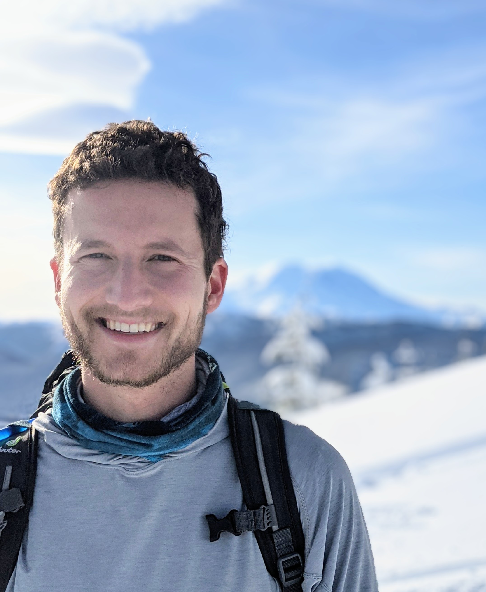

        

            
            
        

    
 
            
I'm a postdoctoral researcher in the Department of Biostatistics, Epidemiology and Informatics at the University of Pennsylvania, working with Dr. Yong Chen. I received my PhD in August 2023 from the Department of Biostatistics at the University of Washington, where I was advised by Dr. Marco Carone and Dr. Noah Simon. Before my PhD, I studied Organismic and Evolutionary Biology at Harvard University, with a language citation in Spanish, and worked as a research associate at the Institute for Genomic Medicine at Columbia University.
             
             
            My research is focused on nonparametric statistics, machine learning, and survival analysis. I am especially interested in statistical epidemiology and methods for assessing variable importance. Prior and ongoing collaborative projects include work in mental health, infectious diseases, and genomic medicine.
             
             
            In July 2025, I will join the Department of Biostatistics and Computational Biology at the University of Rochester as an assistant professor. 
            

            <b>Awards, Honors, Fellowships</b>
             
            <ul>
            <li><b>2023</b> Thomas R. Fleming Excellence in Biostatistics Award, University of Washington</li>
            <li><b>2020</b> Donovan J. Thompson Award, University of Washington</li>
            <li><b>2020-2023</b> NSF Graduate Research Fellowship</li>
            <li><b>2015</b> Phi Beta Kappa, Harvard University</li>
            <li><b>2014</b> Herchel Smith Research Fellowship, Harvard University</li>
            <li><b>2014</b> Microbial Sciences Initiative Research Fellowship, Harvard University</li>
            <li><b>2013</b> John Harvard Scholar, Harvard University</li>
            </ul>
            

            <b>Contact/Links</b>
             
             
            charles_wolock[at]urmc[dot]rochester[dot]edu
            <ul>
            <li><a href = "https://scholar.google.com/citations?user=TPHQuKkAAAAJ&hl=en">Google Scholar</a></li>
            <li><a href = "https://github.com/cwolock">GitHub</a></li>
            </ul>
            

            
 
        

<!---

    

    

    <b>Contact/Links</b> 
     
    cwolock[at]uw[dot]edu
      
    <a href = "https://scholar.google.com/citations?user=TPHQuKkAAAAJ&hl=en">Google Scholar</a>
     
    <a href = "https://github.com/cwolock">GitHub</a>
     
    <a href = "https://www.biostat.washington.edu/people/charles-wolock">Student webpage</a>
    

    

    

-->

<!---
    

    cwolock[at]uw[dot]edu

    &nbsp;&nbsp;&nbsp;&nbsp;

    <a href = "https://scholar.google.com/citations?user=TPHQuKkAAAAJ&hl=en">Google Scholar</a>
    
    &nbsp;&nbsp;&nbsp;&nbsp;

    <a href = "https://github.com/cwolock">GitHub</a>
    
    &nbsp;&nbsp;&nbsp;&nbsp;

    <a href = "https://www.biostat.washington.edu/people/charles-wolock">Student webpage</a>
-->
<!---

--->
<!---
## Contact/Links

**cwolock** *at* **uw** *fullstop* **edu**

Department of Biostatistics\\
Box 357232\\
University of Washington\\
Seattle, WA 98195

* [Google Scholar](https://scholar.google.com/citations?user=TPHQuKkAAAAJ&
hl=en)
* [GitHub](https://github.com/cwolock)
* [LinkedIn](https://www.linkedin.com/in/charles-wolock-918974121/)
* [Student webpage](https://www.biostat.washington.edu/people/charles-wolo
ck)

-->

<!---

Welcome to my research page! I'm a PhD student in Biostatistics at the [University of Washington](http://biostat.washington.edu/).

Before joining UW Biostatistics, I studied Organismic and Evolutionary Biology at [Harvard University](http://oeb.harvard.edu/), with a language citation in Spanish. I was a research associate at the [Institute for Genomic Medicine](http://igm.columbia.edu) at Columbia University.

I currently work with [Dr. Noah Simon](https://faculty.washington.edu/nrsimon/) and [Dr. Marco Carone](http://faculty.washington.edu/mcarone/about.html), developing nonparametric estimation methods for variable importance in the context of survival analysis. My collaborative projects include work with [Dr. Bruce Weir](https://www.biostat.washington.edu/people/bruce-weir) and [Dr. Sam Wasser](https://www.biology.washington.edu/people/profile/samuel-k-wasser), adapting forensic genetic techniques to combat elephant poaching. My research is supported by an [NSF Graduate Research Fellowship](https://www.nsfgrfp.org/).
-->
